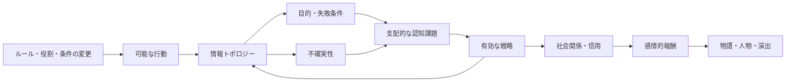
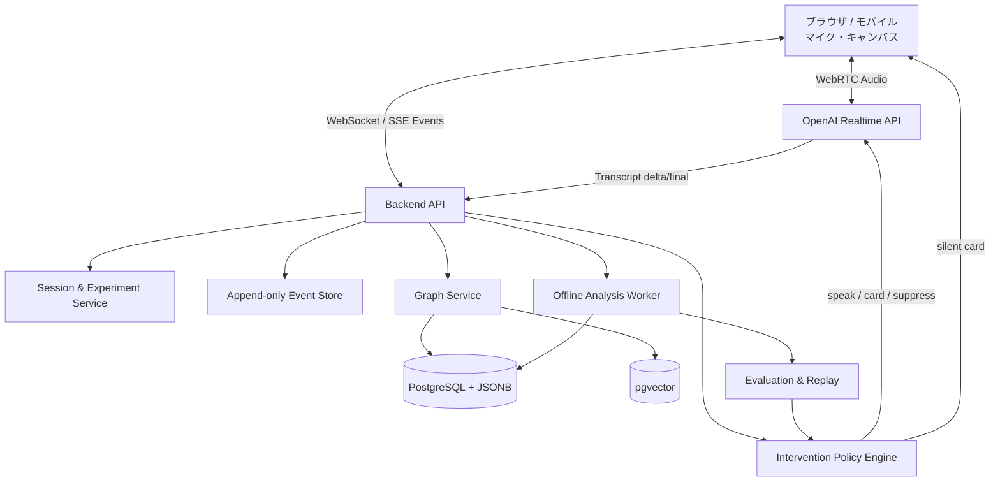
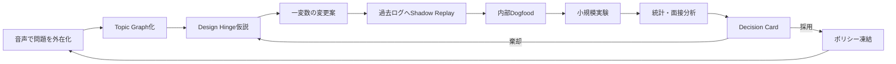

# リアルタイム音声ブレスト開発における「正しい試行錯誤」研究設計書

**結論：Voice Topic Graph / Design Hingeは、「高性能な音声AI」ではなく、介入の条件・形式・因果仮説を一つずつ変更し、人間由来の発想・主体性・設計理解を損なわずに改善できる《実験基盤》として開発すべきです（採用確度95%）。**

## Executive Summary

### 推奨する開発原則

本プロジェクトにおける「正しい試行錯誤」は、機能を追加して使用感を見ることではありません。各反復を、次の形式で記録・比較できる状態を指します。

```text
変更した変数
    ↓
想定した作用機序
    ↓
観測可能な中間変数
    ↓
人間由来の成果・負荷・主体性
    ↓
採用／棄却／再検証
```

最重要の判断は、**総アイデア数を主目的にしないこと**です。生成AIとの共同ブレストでは、人間とAIを合算した案数・カテゴリー・新規性・価値が向上する一方、人間本人が生み出す案数は減少し得ます。また、AI案の評価作業へ負荷が移るため、認知負荷が必ず下がるわけでもありません。さらに、ChatGPT由来のアイデアが個々の案を改善しながら、案の集合全体を似た方向へ収束させる危険も報告されています。citeturn13view0turn13view1turn13view2turn13view3

したがって、研究上の主目的を次のように定義します。

> **AIが多く考えることではなく、人間が自分で考え続けられる状態を維持しながら、発話を構造化し、因果の欠落と反実仮想を提示すること。**

### 推奨する三段階の研究計画

| 段階 | 目的 | 推奨人数 | 主な判断 |
|---|---:|---:|---|
| 計測基盤パイロット | ログ欠損、音声認識、グラフ誤抽出、割り込み事故の発見 | 8～12人 | 実験可能なシステムか |
| 介入ポリシーパイロット | 有望なタイミング・形式を絞る | 18～24人・被験者内 | 本試験に残す2条件は何か |
| 確証試験 | 人間由来発想・因果理解・負荷への効果を検証 | 68～90人・被験者内 | 仮説を支持できるか |
| 外的妥当性試験 | 学習効果や一般利用時の影響を検証 | 266人以上・被験者間2群 | 別ユーザーでも再現するか |

確証試験の最小目安68人は、両側検定、有意水準5%、検出力90%、対応のある標準化効果量 \(d_z=0.40\) を仮定した計算です。欠測、順序効果、複数タスクを考慮し、実募集は76～90人を推奨します。被験者間で同程度の効果 \(d=0.40\) を検出するには、約133人／群、計266人が必要です。サンプルサイズは小規模パイロットの観測効果量だけで決めず、最小重要効果量、検出力、精度、研究目的から事前に正当化する必要があります。citeturn14view8

### 推奨MVP

最初のMVPは、以下の範囲に限定します。

| 必須 | 後回し |
|---|---|
| 日本語音声のリアルタイム文字起こし | 完全自動の個人最適化 |
| アイデア・前提・制約・因果のグラフ化 | 感情推定 |
| 人間由来／AI由来の出所記録 | 大規模グラフDB |
| 介入ポリシーのバージョン管理 | 強化学習による自動最適化 |
| Shadow Modeによる非発話評価 | 複数人同時会話 |
| 介入理由と信頼度の表示 | 自動ゲーム生成 |
| 反実仮想を一変数ずつ作る機能 | 音声だけで全操作を完結 |

ブラウザ・モバイルクライアントはWebRTC、サーバーはセッション発行・実験割付・ポリシー制御・ログ記録を担当させます。OpenAIのRealtime APIはリアルタイム音声・テキスト入力、音声・テキスト出力、ツール呼び出しに対応し、ブラウザ向けにはWebRTCを利用できます。現行のRealtimeモデル群には、低コスト・低遅延向けのモデルも用意されています。モデル名をコードへ固定せず、実験ごとにモデルとスナップショットを記録する構造が必要です。citeturn12view6turn14view0turn17search0

### 最初に検証すべき仮説

**中核仮説：**

> 90秒間AIが案を提示せず、停滞または因果グラフ上の欠落を検出したときだけ、一問・一文の質問または反実仮想を提示する条件は、通常の自由会話型AIより、人間由来のカテゴリー数と主体性を維持しながら、因果深度を高める。

採用確度88%。根拠は、StepWriteにおける段階的・文脈適応型質問の負荷低減、Oralityにおける音声の意味グラフ化、生成AIブレストにおける人間由来案の減少と多様性収束の知見が同じ方向を示すためです。citeturn12view0turn13view6turn13view0turn13view3

## 研究目標と理論基盤

### 開発対象の分離

Voice Topic GraphとDesign Hingeは、役割を分離して設計します。

| システム | 中心機能 | 成功条件 |
|---|---|---|
| Voice Topic Graph | 発話を意味単位へ分解し、アイデア・前提・制約・問い・矛盾として外在化する | ユーザーが話の構造を失わず、戻り、分岐し、修正できる |
| Design Hinge | ルール・役割・条件の変更が、情報・行動・認知・感情・物語へどう伝播するかを比較する | 小さな変更から生じる広い影響を、反証可能な因果仮説として表現できる |
| Experiment Engine | AIの介入タイミング・形式・強度を割り付け、結果を比較する | 同じ変更を再現し、別条件と統計的に比較できる |
| Development Loop | システム自体を使って仮説・実装・評価・意思決定を記録する | 開発判断の理由と証拠が追跡できる |

### Design Hingeの標準因果モデル

提示動画と手書きメモは、最初のゴールドスタンダード入力事例として適しています。動画では、主人公が容疑者となり、「容疑者は調査できない」という既存ルールの適用対象が変化します。その結果、一次情報の欠落、他者への依存、信用管理、発言反応からの情報抽出、嘘の機能化、爽快感の変化、主人公の性格とゲームシステムの一致、最終章の説得戦への学習が連鎖しています。fileciteturn0file0

手書きメモにある「調査可否→情報条件→ミステリー／人狼的ゲーム性」という分岐は、以下の標準グラフへ拡張します。



各エッジには、次の属性を持たせます。

| 属性 | 内容 |
|---|---|
| `relation` | causes、enables、blocks、depends_on、contradicts、transforms |
| `confidence` | 0～1の推定信頼度 |
| `evidence_type` | 直接ルール、ユーザー仮説、AI推論、既存研究、プレイテスト |
| `provenance` | 人間、AI、共同編集 |
| `test_status` | 未検証、反証試行中、部分支持、支持、棄却 |
| `scope` | この作品だけ、類似作品、一般仮説 |
| `counterfactual` | 当該要素を戻したとき予測が消えるか |

これにより、「説明として面白い」ことと「因果として支持される」ことを分離できます。

### 先行研究・関連システムから採用する要素

| 研究・アプリ | 採用する知見 | 本システムでの拡張 |
|---|---|---|
| StepWrite | 文脈に応じた一問ずつの音声質問、状態保持、戻る・修正する操作 | 発話内容ではなく、発想状態と因果グラフの欠落に応じて質問する |
| Orality | 音声を意味ノードへ分解し、非線形なキャンバスとして操作 | ノードを設計上の型へ分類し、反実仮想と検証状態を持たせる |
| 生成AIブレスト研究 | 総成果と人間本人の成果を分けて測る | 人間由来、AI由来、共同編集をログレベルで分離 |
| Sentient Sketchbook | ユーザー案を評価し、リアルタイムに代替案を並置 | 完成案ではなく、変更一変数の隣接世界を提示 |
| Machinations | システムを形式化し、変更前後やwhat-ifを比較する | 数量フローに加え、情報・認知・感情の仮説グラフを扱う |
| Ludo.ai | キーワード・ジャンル・メカニクスから多数案を生成・派生 | 大量案生成はオプションに限定し、因果の説明と反証を中心にする |
| SPINE | デザインピラーを明文化し、意思決定との整合を確認する | ピラー整合に加え、変更が体験へ届く経路を可視化する |

StepWriteは25人の被験者内研究で、通常の音声入力およびChatGPT音声モードと比較し、構造化された逐次質問による認知負荷・修正負担の低減を報告しています。生成された質問の77%以上が最終成果へ必要な情報に寄与しました。citeturn12view0

Sentient Sketchbookは、ユーザーのレベル案に対してプレイ可能性や特性を評価し、制約付き新規性探索から代替案をリアルタイム提示しました。Machinationsは、モデルの異なるバージョンに対するMonte Carlo予測、what-if比較、履歴への復帰、CSV出力を提供しています。Ludo.aiはキーワード、テーマ、ジャンル、ゲームメカニクス、既存タイトルから案を生成し、派生案やGDDへ展開します。citeturn15view1turn17search1turn17search3turn15view2

SPINEはデザインピラーを自然言語上の制約として形式化し、作成と意思決定をLLMで支援する初期研究です。ただし、2026年時点では小規模事例と専門家インタビューを中心とする初期的証拠であり、Design Hingeも同様に、最初から一般的な設計法則と主張せず、検証可能な仮説として蓄積すべきです。citeturn15view3

## 実験設計と介入ポリシー

### 介入ポリシー候補

介入は「AIが発言するか」だけでなく、**いつ、なぜ、どの形式で、どこに提示するか**へ分解します。

| ポリシー | 発火条件 | 介入形式 | 想定効果 | 主なリスク |
|---|---|---|---|---|
| Listening Only | なし | 文字起こしとグラフ更新のみ | 人間単独の思考を保護 | 停滞から復帰できない |
| Reactive | 明示コマンド時のみ | 質問、要約、反実仮想 | 主体性が高い | 必要時に支援を要求できない |
| Silence Trigger | 一定時間の沈黙 | 短い問い | 停滞復帰 | 熟考中の割り込み |
| Stagnation Trigger | 新規ノード率低下、同内容反復 | 視点変更の問い | 発散の再開 | 類似表現を停滞と誤認 |
| Graph-Gap Trigger | 孤立ノード、因果飛躍、未定義前提 | 因果確認質問 | 設計理解を深める | 創作を論理化しすぎる |
| Contradiction Trigger | 目標・ルール・仮説の衝突 | 対立の可視化 | 隠れた前提を発見 | 発散段階で評価を始める |
| Counterfactual Trigger | 変更案が確定したとき | 一変数を戻した世界 | 因果要因を分離 | 選択肢過多 |
| Phase-Aware | 発散・構造化・収束の状態 | 状態別に形式を変更 | フェーズ混線を防ぐ | 状態推定の誤り |
| Adaptive Policy | 履歴・個人特性・反応から調整 | 最適候補 | 長期個人化 | ブラックボックス化、過適応 |

Koalaの研究では、積極的に会話へ入り込むAIに対し、割り込みや情報量過多への懸念が示され、AI参加のタイミングとユーザー制御の重要性が示されています。したがって、MVPではReactiveまたはGraph-Gap型を中心とし、常時プロアクティブ型を初期値にしない判断が妥当です。citeturn15view4

### 介入パラメータと初期値

以下は科学的に確立された最適値ではなく、**最初の探索範囲**です。

| パラメータ | 探索候補 | 推奨初期値 | 調整根拠 |
|---|---|---|---|
| VAD方式 | server / semantic | semantic | 文末意味を考慮し、自然な間を待つ |
| Semantic VAD eagerness | low / medium / high | low | 熟考中の割り込み抑制 |
| 発散ウォームアップ | 0 / 60 / 90 / 120秒 | 90秒 | 初期固定化を防ぐ |
| 沈黙閾値 | 2 / 4 / 6 / 8秒 | 6秒 | 単独では発火させない |
| 最小介入間隔 | 20 / 40 / 60 / 90秒 | 45秒 | 介入過多を防ぐ |
| 最大音声長 | 5 / 8 / 12 / 20秒 | 8秒 | 一問・一文を維持 |
| 一回の問い数 | 1 / 2 / 3 | 1 | 認知負荷を制限 |
| 新規性低下窓 | 2 / 3 / 5発話 | 3発話 | 停滞判定の平滑化 |
| 類似度閾値 | 0.75 / 0.85 / 0.92 | 0.85 | 同義反復の暫定判定 |
| 孤立ノード閾値 | 1 / 2 / 3個 | 2個 | 偶発的な孤立を許容 |
| 因果信頼度閾値 | 0.60 / 0.75 / 0.90 | 0.80 | 不確かな自動断定を抑制 |
| 介入表示 | 音声 / カード / 両方 | カード優先 | 思考を遮らず参照可能 |
| 音声介入条件 | 自動 / 承認後 / 明示要求 | 承認後 | 主体性を保護 |
| フェーズ遷移 | 自動 / 手動 / ハイブリッド | ハイブリッド | AIは提案、決定は人間 |
| アイデア直接提示 | 常時 / 停滞時 / 要求時 | 要求時のみ | AI固定化を防止 |
| 反実仮想数 | 1 / 3 / 5 | 3 | 比較可能性と負荷の均衡 |
| 割り込み後抑制 | 10 / 20 / 40秒 | 20秒 | 話し直しを優先 |
| 介入信頼度表示 | 非表示 / 3段階 / 数値 | 3段階 | 偽精密性を避ける |

OpenAIのRealtime APIは`server_vad`と`semantic_vad`を提供し、`semantic_vad`の`eagerness`をlowにすると、ユーザーが時間をかけて話せるよう待ち時間を長くできます。したがって、ブレストの初期値はlowが妥当ですが、最適値は日本語話者の実音声で検証する必要があります。citeturn13view7

### 反実仮想・ablation実験群

すべての因子を一度に掛け合わせると、条件数と必要人数が膨張します。**表現→タイミング→形式→個人化**の順で絞ります。

#### システム全体のablation

| 系列 | 条件 | 除去・変更する要素 | 検証する因果 | 主評価 |
|---|---|---|---|---|
| 表現 | R0：文字起こしのみ | グラフなし | グラフ自体の効果 | 記憶負荷、カテゴリー数 |
| 表現 | R1：Topic Graph | 因果型なし | 非線形外在化の効果 | 構造理解、修正回数 |
| 表現 | R2：Design Hinge Graph | 因果・反実仮想あり | 因果表現の追加効果 | 因果深度、反証数 |
| タイミング | T0：Reactive | 自動介入なし | ユーザー主導の基準 | 主体性、停滞時間 |
| タイミング | T1：固定45秒 | 状態適応なし | 単純な定期刺激 | アイデア率、割り込み感 |
| タイミング | T2：停滞適応 | 内容に応じて介入 | 適応タイミングの価値 | 介入後の新規ノード率 |
| 形式 | F0：質問 | AI案なし | 問いによる足場掛け | 人間由来案 |
| 形式 | F1：完成案 | AIが直接案を出す | 直接生成の利得と固定化 | 総案数、多様性、所有感 |
| 形式 | F2：反実仮想 | 一変数を変更 | 因果分解の効果 | 因果識別、設計整合性 |
| モダリティ | M0：無音カード | 音声出力なし | 視覚提示の低侵襲性 | 流れ中断、参照率 |
| モダリティ | M1：音声 | カードなし | 音声のみの利便性 | 応答速度、忘却率 |
| 出所 | P0：出所非表示 | provenanceなし | 出所表示の効果 | 所有感、AI依存 |
| 出所 | P1：人間／AI表示 | 出所を明示 | 責任・主体性の保護 | 採用率、修正率 |

#### 提示動画・メモに対するDesign Hinge ablation

| 条件 | 主人公の立場 | 調査権限 | 情報信頼性 | 分離できる原因 |
|---|---|---|---|---|
| D0 | 調査者 | 調査可能 | 高い | 基準 |
| D1 | 容疑者 | 調査可能 | 高い | 「疑われる立場」だけの効果 |
| D2 | 調査者 | 調査不能 | 高い | 「一次情報不足」だけの効果 |
| D3 | 容疑者 | 調査不能 | 高い | 立場と情報不足の交互作用 |
| D4 | 容疑者 | 調査に疑惑コスト | 高い | 禁止を連続的コストへ変えた効果 |
| D5 | 容疑者 | 調査不能 | 他者報告が完全 | 情報量と信用問題の分離 |
| D6 | 容疑者 | 調査不能 | 他者報告が不完全 | 社会的推理化の原因 |
| D7 | 容疑者 | 代理調査可能 | 代理人ごとに偏る | 交渉・委任・信頼ネットワークの効果 |

D1～D3の比較により、「人狼的な体験」が疑われる立場から生じるのか、一次情報不足から生じるのか、両者の交互作用なのかを切り分けられます。D5～D6では、情報不足と情報信頼性を分離できます。

### 実験プロトコル

#### 参加者と課題

対象は18歳以上の日本語話者とし、ゲームデザイン経験、生成AI利用頻度、音声インターフェース経験を事前測定します。初期研究は一人ブレストを対象とし、複数人会話は別研究に分けます。

各参加者は、難易度を事前評価した3課題を扱います。

| 課題 | 内容 | 目的 |
|---|---|---|
| ゲーム設計課題 | 提示動画・メモのルール変更を別条件へ展開 | Design Hingeの基準事例 |
| 新規メカニクス課題 | 与えられたゲームへ一変更で体験を変える | 新規設計能力 |
| 非ゲーム課題 | 教育サービスや業務プロセスの制約変更 | 一般化可能性 |

#### 被験者内プロトコル

```text
同意・事前質問票 10分
        ↓
音声と操作の練習 5分
        ↓
条件A 12～15分
        ↓
質問票 5分・休憩3分
        ↓
条件B 12～15分
        ↓
質問票 5分・休憩3分
        ↓
条件C 12～15分
        ↓
最終比較・刺激再生面接 20～30分
```

条件順はラテン方格で均等化し、課題と条件の組み合わせも交差させます。同一参加者が同じ課題を複数条件で行うと学習効果が強いため、**同等難度の異なる課題**を用意します。

#### 推奨サンプルサイズ

| 研究 | 設計 | 完了者数 | 募集目安 | 根拠 |
|---|---|---:|---:|---|
| 技術パイロット | 被験者内 | 8～12 | 10～14 | 欠陥発見目的。効果検定はしない |
| ポリシー探索 | 3条件・被験者内 | 18～24 | 22～28 | 大きな失敗と分散の確認 |
| 確証比較 | 2条件・被験者内 | 68 | 76～80 | \(d_z=.40\)、90% power |
| 3条件確証 | 被験者内・混合モデル | 72～90 | 82～100 | 多重比較と順序効果を考慮 |
| 外的妥当性 | 2群・被験者間 | 266 | 約300 | \(d=.40\)、90% power |
| 4群因子試験 | 被験者間 | 【未指定】 | シミュレーションで算出 | 交互作用の最小重要効果が必要 |

**推奨判断：**最初の確証試験は被験者内2条件に限定します（確度93%）。同じ参加者の個人差を差し引けるため、被験者間設計より少ない人数で介入差を検出できます。ただし、学習効果とAIへの順応が主要論点になった段階で、被験者間または長期縦断試験へ移行します。

### マイクロランダム化

通常の条件比較とは別に、実セッション中の「介入可能時点」で次をランダム化します。

```text
介入可能条件を満たす
   ├─ 50%：質問する
   └─ 50%：質問しない
          ↓
次の60～120秒の新規ノード数・話し始めまでの時間を比較
```

これはJust-in-Time Adaptive Intervention研究で用いられるMicro-Randomized Trialの応用です。参加者単位だけでなく、各意思決定時点で介入有無を無作為化し、短期的効果と「どの状況で効くか」を推定できます。音声ブレストへの転用は本研究上の提案ですが、介入ルールを経験則だけで最適化するより、因果的に頑健です。citeturn11search5turn11search17

安全上、以下の場合はランダム化対象外とします。

- ユーザーが「黙って」と指定中
- AI発話直後
- STT信頼度が低い
- 感情的・機密性の高い発話を検出
- セッション終了操作中
- 介入上限を超過

## 評価指標・データ・分析

### 主要・副次評価指標

主評価を事前に三つへ限定します。

1. **人間由来の柔軟性**：人間本人が出した異なるカテゴリー数  
2. **検証済み因果深度**：変更から影響まで、評価者が妥当と認めた最長経路  
3. **主体性・所有感**：成果を自分の判断として説明・修正できる感覚  

総案数、AIを含む品質、使用感などは副次指標とします。

| 分類 | 指標 | 測定方法 | データ源 |
|---|---|---|---|
| 発想量 | 人間由来アイデア数 | 重複を除いたノード数 | provenance付きログ |
| 柔軟性 | 人間由来カテゴリー数 | 独立評価者の分類＋埋め込みクラスタ | グラフ、評価者 |
| 新規性 | 専門家評価 | 1～7段階、盲検評価 | CAT方式 |
| 意味距離 | SemDis相当 | 課題語・既出案との埋め込み距離 | 埋め込み |
| 有用性 | 実装価値・目的適合 | 専門家1～7段階 | 評価票 |
| 実現可能性 | コスト・技術・ルール整合 | 専門家1～7段階 | 評価票 |
| 因果深度 | 最長妥当パス | 評価者が各エッジを支持／棄却 | Design Hinge Graph |
| 影響範囲 | 到達した層数 | 行動、情報、目的、認知、戦略、感情、物語 | グラフ |
| 反実仮想識別 | 原因切り分け数 | 一変数を戻して予測差を説明できた数 | 条件比較 |
| グラフ精度 | node/edge precision・recall・F1 | 人手アノテーションを正解集合とする | システム出力 |
| 介入有効性 | 介入後成果率 | 60秒以内の新規有効ノード | イベントログ |
| 割り込み | 中断率 | AI発話時にユーザー発話中だった割合 | VADログ |
| 応答遅延 | p50・p95 | 発話終了から表示／音声開始まで | システムログ |
| STT品質 | CER、固有語誤認率 | 手動正解文字起こしとの比較 | 音声・転記 |
| 負荷 | NASA-TLX | 6下位尺度 | 質問票 |
| 創造支援 | CSI | 探索、表現、没入、楽しさ等 | 質問票 |
| 主体性 | 所有感尺度 | 事前定義したLikert項目 | 質問票 |
| 固定化 | AI後のカテゴリー集中 | AI提示前後のカテゴリ分布変化 | 時系列ログ |
| 会話比率 | 人間／AI発話時間 | 音声区間集計 | VADログ |
| 再利用性 | 後日説明・再開成功率 | 24～72時間後の再開課題 | 追跡試験 |

NASA-TLXは精神的要求、身体的要求、時間的要求、達成度、努力、フラストレーションを測る多次元負荷尺度です。Creativity Support Indexは、探索、表現、没入、楽しさ、努力に見合う成果、協働など、創造支援ツールの体験を測るために設計されています。citeturn15view6turn15view5

新規性は埋め込み距離だけで判断しません。SemDisのような意味距離指標は、人間評価と一定の関係を持つ自動補助尺度ですが、創造性は距離が遠いほど無条件に高いわけではありません。専門家による盲検評価と併用します。citeturn14view7

専門家評価はConsensual Assessment Techniqueに基づき、適切な評価者間で創造性の合意を取ります。平均評価は安定し得る一方、個々の評価者は時間とともに基準がずれる可能性があるため、評価順の無作為化、基準例、評価者間信頼性を記録します。citeturn11search12turn11search20

### 主体性・所有感の暫定質問項目

以下は本システム用の探索尺度であり、妥当性が確立した尺度ではありません。

| 項目 | 回答 |
|---|---|
| 最終案は自分が考えたものだと感じる | 1～7 |
| なぜこの案になったかを自分の言葉で説明できる | 1～7 |
| AIの提案を拒否・修正できた | 1～7 |
| AIに思考の方向を奪われたと感じる | 1～7・逆転 |
| AIがなくても続きを考えられる | 1～7 |
| 結果に対して自分が責任を持てる | 1～7 |

本試験前に認知インタビューを行い、項目の理解、重複、天井効果を確認します。内的一貫性だけでなく、専門家評価、AI案採用率、説明課題との収束・弁別妥当性を検討します。

### データ収集項目

| 層 | 必須項目 | 保存方針 |
|---|---|---|
| 参加者 | 研究ID、年齢帯、日本語習熟度、設計経験、AI利用頻度 | 氏名・連絡先とは分離 |
| セッション | 条件、課題、順序、開始終了時刻、ポリシー版 | 永続 |
| モデル | モデル名、スナップショット、プロンプト版、温度相当設定 | 再現性のため永続 |
| 音声 | 生音声、VAD区間、発話者、割り込み | 生音声は短期保存 |
| STT | delta、final、信頼情報、手動修正、item_id | finalを主要分析に使用 |
| グラフ | ノード追加・削除・統合・分割、エッジ、信頼度 | append-only履歴 |
| 介入 | 候補時刻、発火特徴、提示内容、形式、採用・無視 | 未提示候補も保存 |
| 操作 | 戻る、修正、削除、固定、AI案拒否、フェーズ変更 | イベントログ |
| 成果 | アイデア、選定案、反実仮想、最終説明 | 出所を保持 |
| 主観 | NASA-TLX、CSI、主体性、割り込み感 | 条件ごと |
| 面接 | 刺激再生面接、重大事象、改善要望 | 仮名化 |
| 性能 | レイテンシ、切断、APIエラー、費用、トークン | 運用監視 |

Realtime transcriptionでは、途中の`delta`と確定した`completed`イベントが送られます。異なる発話ターンの確定イベント順は保証されないため、`item_id`で音声、文字起こし、グラフ更新を対応させます。日本語固有語、作品名、専門用語は、transcription contextのキーワードとして与え、CERだけでなく空転記、途中切断、遅延も個別に測ります。citeturn16view0turn16view1

### データ分析手法

#### 基本統計モデル

| アウトカム | 推奨モデル |
|---|---|
| アイデア数・カテゴリー数 | 負の二項混合モデル |
| 因果深度・意味距離 | 線形混合モデル、分布に応じてロバスト回帰 |
| 1～7段階評価 | 累積リンク混合モデル |
| 介入採用・拒否 | ロジスティック混合モデル |
| 次のアイデアまでの時間 | 生存時間分析 |
| 介入後の時系列変化 | イベントスタディ／中断時系列 |
| グラフ精度 | precision、recall、F1と信頼区間 |
| 評価者一致 | ICC、Krippendorffのα |
| 条件間分布 | ペア差プロット、raincloud plot |

基本式は次を推奨します。

```text
outcome
  ~ condition
  + task
  + order
  + expertise
  + prior_AI_use
  + condition × expertise
  + (1 | participant)
  + (1 | task_prompt)
```

主効果だけでなく、ユーザー経験による調整効果を探索します。ただし、確証試験で事前登録する交互作用は最大一～二個に制限します。

#### 因果推定

| 問い | 推定方法 | 注意点 |
|---|---|---|
| ポリシー全体が成果を変えたか | 条件の無作為割付 | Intent-to-treatを主分析 |
| 介入の瞬間効果はあるか | Micro-Randomized Trial | 介入可能時点の定義を固定 |
| 効果は初心者と熟練者で違うか | 事前指定の交互作用 | 多重比較を抑える |
| 負荷低下が成果を媒介したか | 媒介分析 | 探索的。強い因果主張を避ける |
| 主体性低下が人間由来案を減らしたか | 時系列媒介・構造方程式 | 時間順序と未測定交絡に注意 |
| 適応ポリシーを比較できるか | ランダム化ログによるオフライン評価 | 早期に完全自動最適化しない |

**重要な反証条件：**AI条件で総アイデア数が増えても、人間由来カテゴリー数または主体性が事前に定めた許容下限を下回れば、改善とは扱いません。

推奨ガードレールは次です。

```text
主効果条件：
検証済み因果深度が基準条件より改善

非劣性条件：
人間由来カテゴリー数の低下が -0.25 SD以内
主体性の低下が -0.25 SD以内
NASA-TLXの増加が +0.25 SD以内
```

0.25 SDは暫定的な最小重要差であり、パイロット後に専門家・利用者との合意で確定します。

#### 可視化

- 参加者ごとのペア差プロット
- 介入時刻を中心とした前後120秒の新規ノード発生率
- 変更ルールから影響までのSankey図
- 条件別の人間由来／AI由来ノード比率
- 反実仮想条件間のGraph Diff
- 介入信頼度と実際の有効率のCalibration Plot
- ユーザーごとの「介入量―成果」曲線
- AI提示後のカテゴリー分布収束図

多重比較はHolm法またはFDRで調整し、p値だけでなく効果量と95%信頼区間を報告します。

## MVPアーキテクチャ

### 推奨構成



### コンポーネント要件

| 層 | MVP要件 | 推奨技術・設計 |
|---|---|---|
| クライアント | 音声入出力、ライブ文字起こし、グラフ表示、停止・削除 | React / Next.js相当 |
| 音声接続 | 低遅延、割り込み、モバイル対応 | WebRTC |
| APIゲートウェイ | 一時セッション、認証、実験割付 | Node.js / TypeScriptまたはFastAPI |
| Realtime Agent | 音声理解、短い質問、ツール呼び出し | Realtimeモデルを抽象化 |
| STT | delta/final、固有語文脈、日本語評価 | Realtime transcription |
| Policy Engine | 発火条件、上限、無作為化、Shadow Mode | 決定論的状態機械＋分類モデル |
| Graph Extractor | ノード型・エッジ型・信頼度・出所 | 構造化JSON出力 |
| Event Store | 全変更の時系列履歴 | PostgreSQL append-only |
| Semantic Search | 重複、類似、クラスタ | pgvector |
| Graph Query | 3ホップ程度の因果探索 | MVPではSQL再帰CTE |
| 実験基盤 | 条件割付、バージョン固定、エクスポート | 独自軽量サービス |
| Replay | 過去セッションへ新ポリシーを適用 | オフラインWorker |
| 観測性 | レイテンシ、切断、エラー、費用 | 構造化ログ・トレース |

ブラウザやモバイルのリアルタイム音声には、ネットワーク変動への対応を目的にWebRTCを採用し、APIキーはクライアントへ恒久保存せず、サーバー側でセッションを発行します。Realtime APIはFunction CallingやMCPツールを通じて外部処理を呼び出せるため、グラフ更新や実験ログ記録をツールとして分離できます。citeturn17search4turn12view6turn16view3

### Graph DBの判断

**MVPでは専用グラフDBを採用しない判断を推奨します（確度87%）。**

PostgreSQLにノード、エッジ、イベント、JSONB属性を保存し、意味検索だけpgvectorを使えば、トランザクション、実験ログ、質問票、グラフを一つの基盤で扱えます。pgvectorはPostgreSQL上で完全一致・近似最近傍検索、コサイン距離などを扱えます。citeturn11search0turn11search7

専用グラフDBへの移行条件は、以下のいずれかです。

- 5ホップ以上の経路探索が主要画面になる
- 数百万エッジ規模になる
- 作品横断の因果パターン検索が性能ボトルネックになる
- グラフアルゴリズムがプロダクトの中心になる
- PostgreSQLの再帰クエリが運用上複雑化する

### 推奨データスキーマ

```json
{
  "node": {
    "id": "node_01",
    "session_id": "session_123",
    "type": "rule",
    "label": "容疑者は調査できない",
    "content": "容疑者役の人物は現場調査へ参加できない",
    "origin": "human",
    "confidence": 1.0,
    "created_at_ms": 184220,
    "source_turn_id": "item_003",
    "policy_version": "policy_0.2"
  },
  "edge": {
    "source": "node_01",
    "target": "node_02",
    "relation": "causes",
    "confidence": 0.72,
    "origin": "ai_hypothesis",
    "evidence_status": "untested"
  }
}
```

### 必須イベント

```text
session_started
speech_started
speech_stopped
transcript_delta
transcript_final
node_proposed
node_created
node_corrected
node_merged
node_split
edge_proposed
edge_accepted
edge_rejected
intervention_eligible
intervention_randomized
intervention_delivered
intervention_interrupted
intervention_accepted
intervention_dismissed
phase_change_proposed
phase_changed
counterfactual_created
hypothesis_tested
questionnaire_completed
session_ended
```

`intervention_eligible`を必ず保存する点が重要です。実際に発話した介入だけ記録すると、「発話しなかった場合」と比較できません。

### Realtime AgentとAnalysis Agentの分離

| Agent | 役割 | 許容レイテンシ |
|---|---|---:|
| Realtime Interaction Agent | 相づち、短い質問、割り込み制御 | 低い |
| Graph Extraction Agent | ノード・エッジ候補の抽出 | 1～3秒程度 |
| Policy Agent | 介入可否と形式を決定 | 1秒以内を目標 |
| Offline Analysis Agent | 統合、反実仮想、セッション要約 | 数秒～数十秒 |
| Evaluation Agent | 過去ログの再採点・比較 | 非同期 |

一つの大規模モデルへすべて任せると、モデル更新、プロンプト変更、グラフ抽出、介入判断が混線します。リアルタイム経路は軽量化し、重い因果分析は非同期で行います。Realtimeの低コストモデルは高速な音声対話用に利用し、必要なときだけ別の推論モデルへ構造化テキストを送る構成が妥当です。citeturn14view0

### Shadow Mode

Shadow Modeでは、AIが「介入すべき」と判断してもユーザーには提示しません。

```text
実セッション
  ↓
介入候補・理由・文面を保存
  ↓
ユーザーの自然な次発話を観測
  ↓
「介入しなくても回復したか」を判定
  ↓
誤介入率を計算
```

この機能により、参加者を割り込みへさらす前に、過剰介入をオフラインで減らせます。

## 反復ワークフローと責任分担

### 開発システム自体を使う循環



### 一反復のDecision Card

| 項目 | 記録例 |
|---|---|
| 問題 | 長い沈黙のたびにAIが割り込み、熟考を中断する |
| 変更変数 | 沈黙単独発火→沈黙＋新規性低下のAND条件 |
| 作用機序 | 熟考と停滞を区別できる |
| 予測 | 割り込み率低下、停滞回復率は維持 |
| 主指標 | 発話中割り込み率 |
| ガードレール | 120秒以上の停滞時間 |
| 反実仮想 | 沈黙閾値だけを8秒へ延長した条件 |
| 対象ログ | policy 0.2の過去30セッション |
| 採用条件 | 割り込み30%以上減、停滞時間10%以上悪化しない |
| 結果 | 数値、面接所見、失敗例 |
| 判断 | 採用／棄却／追加試験 |
| 確度 | 例：78%、根拠を一行記載 |

### 推奨タイムライン

期限・リソースが未指定のため、**12週間で研究可能なMVPを作り、その後6～8週間で確証試験を行う**前提です。

| 期間 | 成果物 | 主担当 | 完了条件 |
|---|---|---|---|
| 第1週 | 研究質問、主指標、データ辞書、同意文書 | Research Lead、Privacy | 主仮説と削除方針が承認 |
| 第2週 | 音声接続、Realtimeセッション、基本ログ | Realtime Engineer | 15分通話で欠損なし |
| 第3週 | STT評価セット、用語辞書、CER計測 | NLP Engineer | 日本語基準音声で評価可能 |
| 第4週 | Topic Graph抽出、手動修正UI | NLP＋Frontend | ノード追加・統合・分割可能 |
| 第5週 | Policy Engine、バージョン管理 | Backend＋Research | 同じログで決定を再現 |
| 第6週 | Design Hinge、反実仮想、Graph Diff | Game/HCI＋NLP | 提示事例を構造化 |
| 第7週 | Shadow Mode、Replay、管理画面 | Data＋Backend | 過去ログへ一括再生可能 |
| 第8週 | 内部Dogfood、障害修正 | 全員 | 重大事故ゼロ |
| 第9週 | 技術パイロット8～12人 | HCI Researcher | ログ・質問票・面接が完結 |
| 第10週 | ポリシー修正、測定凍結 | Research＋Engineering | 主条件を変更不能に固定 |
| 第11～12週 | 介入パイロット18～24人 | HCI＋Data | 有望2条件を選定 |
| 追加第1週 | 事前登録、サンプル確定 | Research Lead | 分析計画を凍結 |
| 追加第2～6週 | 確証試験 | Research Operations | 68～90人完了 |
| 追加第7～8週 | 分析、再現、採否判断 | Data＋Research | Decision Memo作成 |

### 責任分担

| 成果物 | Research Lead | HCI Researcher | Realtime Eng. | NLP/ML Eng. | Frontend | Data Scientist | Privacy/Ethics | Domain Expert |
|---|---|---|---|---|---|---|---|---|
| 研究仮説 | A | R | C | C | I | C | C | C |
| 実験プロトコル | A | R | I | C | I | C | C | C |
| 音声基盤 | I | C | A/R | C | C | I | C | I |
| グラフ抽出 | C | C | I | A/R | C | C | I | C |
| UI | C | C | C | C | A/R | I | C | C |
| ポリシー | A | R | C | R | C | C | C | C |
| データ分析 | A | C | I | C | I | R | C | C |
| 倫理・同意 | C | C | I | I | I | C | A/R | I |
| 専門家評価 | C | R | I | I | I | C | I | A/R |
| リリース判断 | A | C | C | C | C | C | C | C |

A＝最終責任、R＝実行責任、C＝相談、I＝共有。

### 「正しい試行錯誤」の運用ルール

| ルール | 違反例 |
|---|---|
| 一反復で主要因子は一つだけ変える | モデル、プロンプト、VAD、UIを同時変更 |
| 計測を作ってから最適化する | 「自然だった」という印象だけで採用 |
| DiscoveryとConfirmationを分ける | パイロット結果を見て仮説を書き換え、同じデータで検定 |
| 人間由来成果と総成果を分ける | AI案を含む総案数だけで成功判定 |
| 介入しなかった時点も記録する | 発話した介入だけ保存 |
| モデル・プロンプト・ポリシー版を固定する | 実験途中で自動更新 |
| AI説明を証拠として扱わない | 「このルールで緊張感が増す」とAIが言っただけで採用 |
| 過去ログでShadow Replayしてから人へ出す | 未検証の積極介入を本番投入 |
| ガードレールを先に定める | 成果増加後に主体性低下を無視 |
| 失敗例を削除せず保存する | 成功セッションだけ学習データ化 |

開発速度の補助指標として、次を導入できます。

```text
検証学習速度
＝
証拠基準を満たして採否判断できた仮説数
÷
研究者時間または参加者時間
```

【不明：標準化・妥当性検証なし。プロジェクト内部の運用指標としてのみ使用】

## リスク・倫理・参考文献

### 技術・研究リスク

| リスク | 影響 | 検出方法 | 対策 |
|---|---|---|---|
| AIが熟考を停滞と誤認 | 思考中断 | 割り込み直後の否定率 | semantic VAD low、承認制 |
| AI案への固定化 | 多様性低下 | AI提示後のカテゴリ集中 | 質問優先、完成案は要求時のみ |
| 総成果だけ改善 | 人間能力の外部委託 | provenance別集計 | 人間由来を主評価 |
| グラフ誤統合 | 意味の捏造 | split/undo率 | 候補表示、ワンクリック修正 |
| 因果の幻覚 | 説得力ある偽説明 | 専門家エッジ評価 | 信頼度・証拠型・未検証表示 |
| STT誤認 | 誤った構造化 | CER、固有語誤認 | 用語辞書、final後再解析 |
| 過剰な論理化 | 発散の萎縮 | 面接・自由発想量 | 発散中は因果評価を遅延 |
| 学習効果 | 被験者内比較の汚染 | 条件順交互作用 | ラテン方格、同等別課題 |
| モデルドリフト | 再現不能 | バージョン差 | スナップショット記録 |
| 個人最適化の過適応 | 狭い思考様式を強化 | 長期多様性 | 探索率、リセット機能 |
| 評価者バイアス | AI条件を高く評価 | 条件推測率 | 出所を隠した盲検評価 |
| 開発チームの確証バイアス | 都合の良い指標選択 | Decision Card監査 | 事前登録、棄却条件固定 |

### 倫理・プライバシー

音声には、発言内容だけでなく、声から本人を識別し得る情報、第三者名、社内機密、健康・家庭・感情に関する情報が入り得ます。法的分類の詳細とは別に、運用上は高感度データとして扱います。日本で研究・提供する場合、個人情報保護法と個人情報保護委員会のガイドラインに基づき、利用目的、第三者提供、保管、削除、匿名加工・仮名化の設計を確認する必要があります。citeturn15view7turn15view8

#### 同意を分離する

| 同意項目 | 必須／任意 |
|---|---|
| セッション中の音声処理 | サービス利用には必須 |
| 生音声の研究保存 | 任意 |
| 文字起こしの研究利用 | 任意 |
| 匿名化したグラフ・ログの研究利用 | 任意 |
| 発話引用の論文・発表利用 | 別途任意 |
| 将来研究への再利用 | 別途任意 |
| モデル改善用データへの利用 | 別途明示 |
| 第三者専門家による評価 | 別途明示 |

#### 保管方針

```text
本人連絡先
  └─ 研究ID対応表：暗号化・アクセス限定

生音声
  └─ 可能な限り30日以内に削除

文字起こし
  └─ 固有名・連絡先・機密語をマスキング

グラフ・イベントログ
  └─ 仮名IDで長期分析

公開データ
  └─ 再識別リスクを別途評価してから作成
```

OpenAI APIのビジネスデータは、デフォルトではモデル学習に使用されません。一方、Realtime endpointでは通常、濫用監視ログが最大30日保持され得ます。承認された組織はZero Data RetentionまたはModified Abuse Monitoringを利用でき、RealtimeはZDR対象として記載されています。ただし、外部MCPサーバーへ送信したデータは、その第三者の保持方針にも従います。citeturn12view7turn16view4turn16view5

#### ユーザー制御

MVPに以下を必須実装します。

- 録音中であることの常時表示
- 即時ミュート
- 「この発話を保存しない」
- セッション削除
- 人間由来／AI由来表示
- AIによる統合・書き換えのUndo
- 「なぜ介入したか」の表示
- 自動介入の無効化
- 音声保存なしでも利用できる設定
- 第三者名が含まれる場合の警告
- データエクスポート

音声から感情、性格、心理状態を推定する機能はMVPへ含めません。研究上必要になった場合も、別同意・別プロトコル・別倫理審査とします。

### 参考文献優先リスト

#### 最優先で読む研究

| 優先 | 文献 | 本プロジェクトで読む箇所 |
|---|---|---|
| S | StepWrite | 逐次質問、VAD、質問必要性、被験者内評価、負荷測定 citeturn12view0 |
| S | Brainstorming with a Generative Language Model | 人間由来成果と人間＋AI成果の分離、認知負荷の移動 citeturn13view0turn13view1turn13view2 |
| S | ChatGPT decreases idea diversity | AI案による集合多様性低下と固定化リスク citeturn13view3 |
| S | Orality | 音声から意味ノード・非線形キャンバスへの変換 citeturn12view4turn13view6 |
| S | Micro-Randomized Trials | 介入可能時点での無作為化と近接効果推定 citeturn11search5 |
| S | OpenAI Realtime VAD / Transcription / WebRTC | 実装パラメータ、イベント設計、音声接続 citeturn13view7turn16view0turn12view6 |

#### 設計支援システム

| 優先 | 文献・アプリ | 取り込む要素 |
|---|---|---|
| A | Sentient Sketchbook | ユーザー案に対するリアルタイム代替案と評価 citeturn15view1 |
| A | Machinations | what-if、複数予測、変更前後比較、履歴 citeturn17search1turn17search3 |
| A | SPINE | デザインピラーの形式化と意思決定支援 citeturn15view3 |
| A | Ludo.ai Game Ideator | 既存の案生成UI・派生案・GDDとの機能差分 citeturn15view2 |
| A | Koala | Reactive／Proactive介入とユーザー制御 citeturn15view4 |

#### 測定・統計

| 優先 | 文献・尺度 | 用途 |
|---|---|---|
| A | NASA-TLX | 認知負荷・努力・フラストレーション citeturn15view6 |
| A | Creativity Support Index | 創造支援体験の多面的測定 citeturn15view5 |
| A | SemDis | 意味距離による新規性補助評価 citeturn14view7 |
| A | Consensual Assessment Technique | 専門家による創造成果評価 citeturn11search12turn11search20 |
| A | Sample Size Justification | SESOI、検出力、精度に基づく人数決定 citeturn14view8 |

#### 実装・ガバナンス

| 優先 | 文書 | 用途 |
|---|---|---|
| A | GPT-Realtime-2.1 mini Model | 現行モデル能力と接続方式の確認 citeturn14view0 |
| A | Realtime with Tools | グラフ更新・実験ログのFunction/MCP設計 citeturn16view3 |
| A | OpenAI Data Controls | API保持期間、ZDR、外部サービス送信 citeturn16view4turn16view5 |
| A | 個人情報保護委員会ガイドライン | 日本国内での利用目的、管理、提供設計 citeturn15view7turn15view8 |
| B | pgvector | MVPでの意味検索・クラスタリング citeturn11search0 |

**最終採用方針：**

```text
最初に作るもの
＝
音声で自由に考える場
＋
背後で更新される意味・因果グラフ
＋
介入しない判断を含むPolicy Engine
＋
一変数だけ変えた反実仮想
＋
全判断を再生できる実験ログ
```

この構成であれば、Voice Topic Graph / Design Hingeは単なるブレストアプリではなく、**「どの介入が、どの状況で、誰の思考を、どの経路で改善または阻害したか」を学び続ける自己検証型の開発基盤**として成立します（確度94%）。
